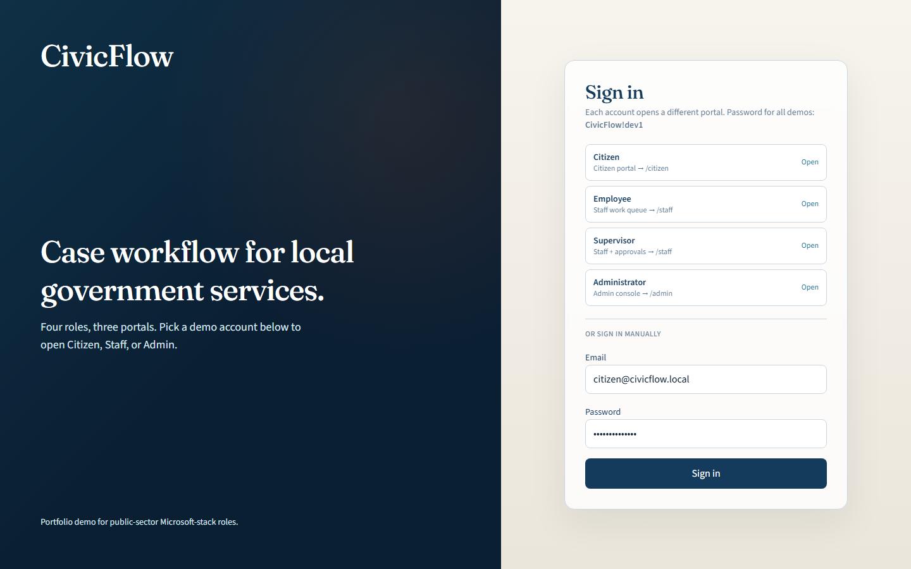
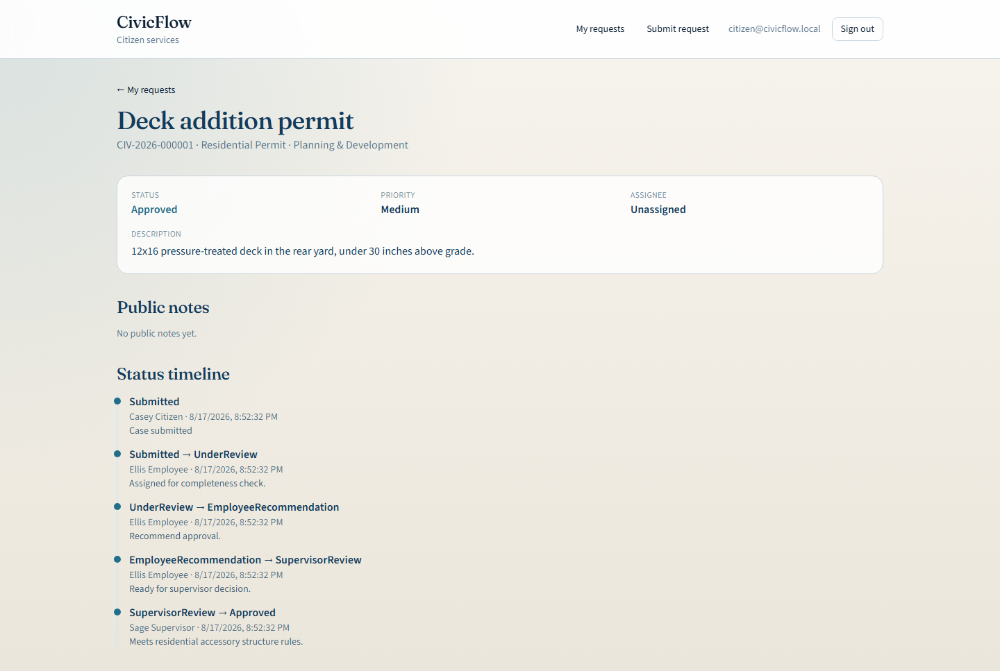
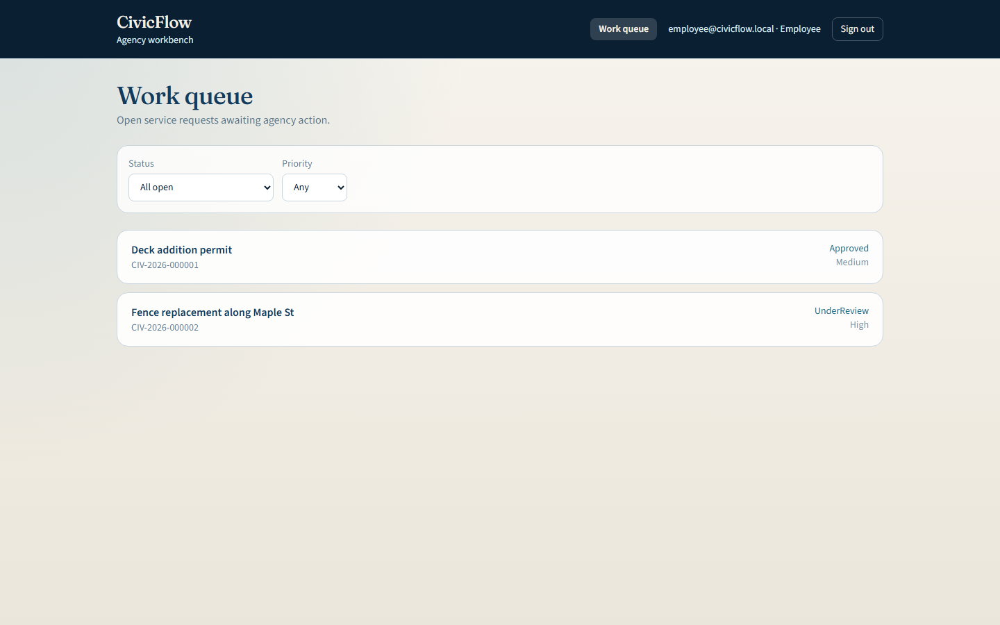
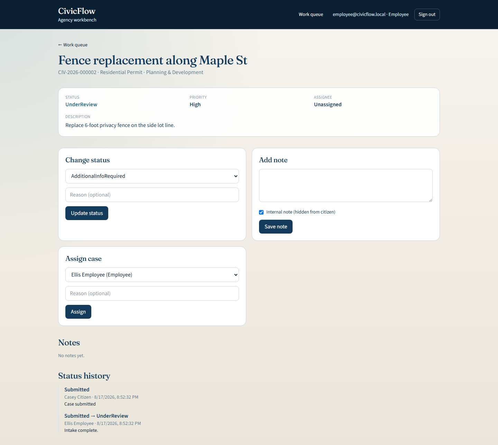
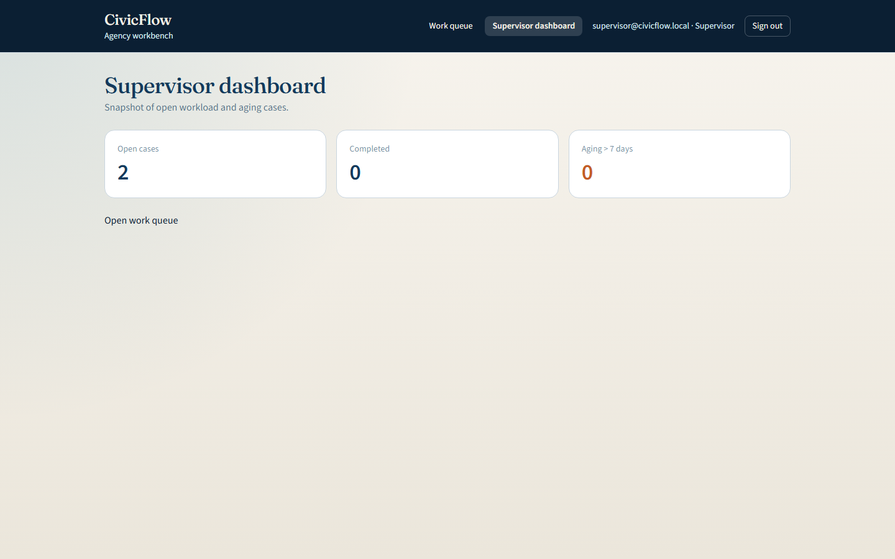
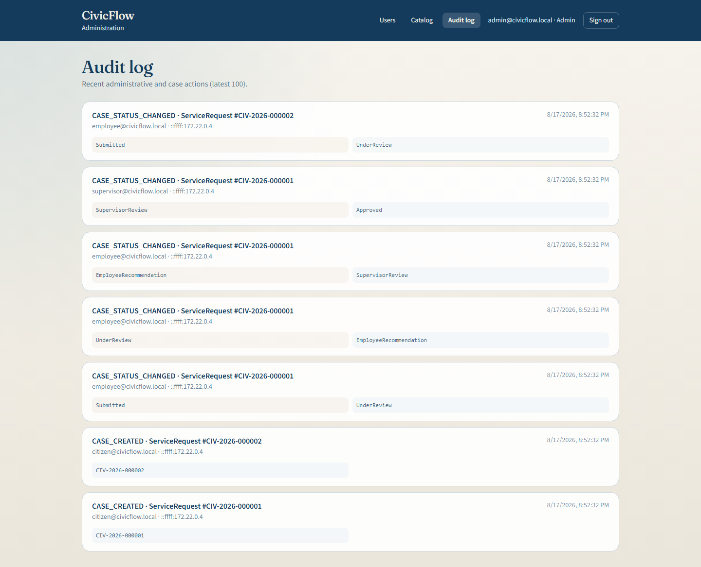

# CivicFlow

Government services case-management platform for city, county, and state-style workflows.

Built as a portfolio project for public-sector / Microsoft-enterprise roles (applications analyst, .NET developer, systems analyst) in the Raleigh–Durham Triangle area.

**Live code:** [github.com/DerrickMcClain/CivicFlow](https://github.com/DerrickMcClain/CivicFlow)

---

## What it demonstrates

- **Controlled workflow** — legal status transitions only (not free-form CRUD status edits)
- **JWT RBAC + resource authorization** — citizens cannot read another citizen’s cases; employees cannot approve
- **Immutable status history + audit log** on mutating case actions
- **Clean layered ASP.NET Core** API with EF Core + SQL Server
- **React + TypeScript** portals for Citizen, Staff/Supervisor, and Admin
- Automated **xUnit** coverage for workflow and authorization paths

## Stack

| Layer | Technology |
|---|---|
| API | .NET 9, ASP.NET Core, JWT Bearer |
| Domain | Workflow policy, request-number formatting |
| Data | EF Core, SQL Server sequence (`CIV-YYYY-######`) |
| Tests | xUnit + `WebApplicationFactory` against SQL Server / LocalDB |
| UI | React 19, TypeScript, Vite, React Router, Tailwind CSS |
| Delivery | Docker Compose, GitHub Actions CI, Azure Bicep (App Service + Azure SQL) |

## Architecture

```text
React SPA (Citizen / Staff / Admin)
        │ HTTPS / JWT / REST
        ▼
 CivicFlow.Api  ──► Controllers (HTTP only)
        │
 CivicFlow.Application  ──► use cases, authz, orchestration
        │
 CivicFlow.Domain  ──► WorkflowPolicy, entities, enums
        ▲
 CivicFlow.Infrastructure  ──► EF Core, JWT, seed, sequence
        │
   SQL Server
```

## Security model

1. Authenticate with local JWT (`sub`, `email`, `role` claims) **or**, when configured, Microsoft Entra ID access tokens with app roles.
2. Authorize by role on endpoints (`Citizen`, `Employee`, `Supervisor`, `Administrator`).
3. Enforce resource ownership in application services (cross-citizen → **403**).
4. Enforce workflow transitions in `WorkflowPolicy` (illegal → **409**).
5. Closed cases (`Completed`, `Cancelled`) are immutable.
6. Internal notes are never returned to citizens.

Microsoft Entra ID is supported as an **optional dual-mode** sign-in (see [Optional Entra ID setup](#optional-entra-id-setup)). Docker Compose and CI stay on seeded JWT unless you configure a tenant.

## Current status

**Done**
- Solution scaffold + domain workflow/entities
- EF Core schema, SQL sequence, demo seed
- JWT login + citizen registration
- Citizen create/list/get/respond APIs
- Staff queue, status, notes, assignment
- Supervisor approve/reject/reassign + dashboard
- Admin users, departments, request types, audit logs
- Health endpoint + standard error envelope `{ status, message, traceId }`
- React shell: login, JWT storage, role-gated routes
- Optional Microsoft Entra ID (MSAL SPA + dual JwtBearer API + app roles)
- Citizen portal: my requests, submit Residential Permit, request detail + timeline
- Staff / supervisor UI: work queue, case actions, supervisor dashboard
- Admin UI: users + roles, catalog (departments / request types), audit log
- Docker Compose local stack (API + SQL Server + nginx-served frontend)
- GitHub Actions CI (build, xUnit, frontend build)
- Azure Bicep template + manual deploy workflow

**Later (optional)**
- Provision a live Azure subscription and follow [Azure deploy](#azure-deploy) if you want a public demo URL. The Bicep template and GitHub workflow are the Azure deliverable; a running cloud instance is not required to review the project.

## Local run (dev)

### Prerequisites

- .NET 9 SDK
- Node.js 20+
- SQL Server **LocalDB** (default for local dev) — or SQL Server / Docker on `localhost,1433` later

### 1. Database connection

Development (`appsettings.Development.json`) uses LocalDB:

```text
Server=(localdb)\MSSQLLocalDB;Database=CivicFlow;Trusted_Connection=True;TrustServerCertificate=True
```

Start LocalDB if needed:

```powershell
sqllocaldb start MSSQLLocalDB
```

Docker SQL (`localhost,1433` / `sa` / `CivicFlow_Sql!23`) is for the Compose stack. Azure SQL is configured by `infra/main.bicep` — see [Azure deploy](#azure-deploy).

Tests default to LocalDB database `CivicFlow_Test` unless `ConnectionStrings__CivicFlow` is set.

### 2. API

```powershell
cd C:\Users\derri\Projects\CivicFlow
dotnet restore
dotnet test CivicFlow.sln
dotnet run --project src/CivicFlow.Api --launch-profile http
```

API listens on `http://localhost:5080`. On startup it migrates the database and seeds demo data. Swagger UI is available in Development.

### 3. Frontend

```powershell
cd frontend
npm install
npm run dev
```

Vite proxies `/api` and `/health` to `http://localhost:5080`. Open `http://localhost:5173`.

API calls use relative paths by default, which is what local dev and the Docker/nginx stack need.
Set the build-time variable `VITE_API_BASE_URL` only when the frontend is served from a different
origin than the API (see [Azure deploy](#azure-deploy)).

### 4. Docker Compose (API + SQL Server + UI)

```powershell
cd C:\Users\derri\Projects\CivicFlow
docker compose up --build
```

| Service | URL |
|---|---|
| UI | `http://localhost` |
| API / health | `http://localhost:8080/health` (also `http://localhost/health` through nginx) |
| SQL Server | `localhost,1433` / `sa` / `CivicFlow_Sql!23` |

The API migrates and seeds on startup. Log in with a seed user below.

## Seed users (local / demo only)

Password for all seeded accounts: `CivicFlow!dev1`

| Email | Role |
|---|---|
| `citizen@civicflow.local` | Citizen |
| `employee@civicflow.local` | Employee |
| `supervisor@civicflow.local` | Supervisor |
| `admin@civicflow.local` | Administrator |

Seed catalog: department **Planning & Development**, type **Residential Permit**.

## Happy-path demo script

1. Citizen signs in and submits a **Residential Permit** request → gets a `CIV-` number
2. Employee moves the case to **Under Review**
3. Employee requests **Additional Info**
4. Citizen responds (returns to **Under Review**)
5. Employee moves to **Employee Recommendation** → **Supervisor Review**
6. Supervisor **approves**
7. Staff marks **Completed**
8. Show **status history** on the case and **audit log** in Admin

## Screenshots

Captured from the Docker local stack (`http://localhost`).













## Azure deploy

Infrastructure as code lives in `infra/main.bicep`; application deployment runs from
`.github/workflows/azure-deploy.yml` (manual `workflow_dispatch` only).

> **Status:** IaC and the deploy workflow are in the repo. There is no live public URL yet. Use this
> as the runbook when you have a subscription; reviewers can read the template without a running app.

### What gets provisioned

| Resource | Purpose |
|---|---|
| Azure SQL logical server + `CivicFlow` database (Basic tier) | Application data |
| SQL firewall rule `AllowAllWindowsAzureIps` | Lets App Service outbound IPs reach the database |
| Linux App Service plan (B1) | Hosts both apps |
| App Service `app-civicflow-api-*` (`DOTNETCORE\|9.0`) | The API |
| App Service `app-civicflow-web-*` (`NODE\|20-lts`) | Serves the built SPA via `pm2 serve --spa` |

Names get a `uniqueString(resourceGroup().id)` suffix so they are globally unique. The API and
frontend are separate origins, so the API is given `Cors__AllowedOrigin` pointing at the frontend
App Service, and the frontend is built with `VITE_API_BASE_URL` pointing at the API App Service.

API app settings written by the template: `ASPNETCORE_ENVIRONMENT=Production`, `ASPNETCORE_URLS`,
`ConnectionStrings__CivicFlow`, `Jwt__Issuer`, `Jwt__Audience`, `Jwt__SigningKey`,
`Jwt__ExpiryMinutes`, `Cors__AllowedOrigin`, and optional `AzureAd__TenantId`, `AzureAd__ClientId`,
`AzureAd__Audience` (empty by default). The API migrates and seeds on startup, so there is no
separate migration step.

### 1. Provision infrastructure

```powershell
az login
az account set --subscription "<subscription-id-or-name>"
az group create --name rg-civicflow-mvp --location eastus

az deployment group create `
  --resource-group rg-civicflow-mvp `
  --template-file infra/main.bicep `
  --parameters sqlAdminLogin=civicflowadmin `
               sqlAdminPassword="<strong-password>" `
               jwtSigningKey="<random-32+-char-key>" `
               location=eastus
```

Record the outputs — `apiAppName`, `webAppName`, `apiBaseUrl`, `webBaseUrl` — they are the inputs to
the deploy workflow:

```powershell
az deployment group show --resource-group rg-civicflow-mvp --name main --query properties.outputs
```

### 2. Grant GitHub Actions access

Create a service principal scoped to the resource group and store the JSON as the repository secret
`AZURE_CREDENTIALS`:

```powershell
az ad sp create-for-rbac --name civicflow-deploy --role contributor `
  --scopes /subscriptions/<subscription-id>/resourceGroups/rg-civicflow-mvp `
  --sdk-auth
```

### 3. Deploy the apps

Run the **Azure deploy** workflow (`workflow_dispatch`) with `api_app_name`, `web_app_name`, and
`api_base_url` from the Bicep outputs. It publishes the API, waits for `/health`, then builds the
frontend with `VITE_API_BASE_URL=<api_base_url>` and deploys `frontend/dist`.

To publish the API without GitHub Actions:

```powershell
dotnet publish src/CivicFlow.Api/CivicFlow.Api.csproj -c Release -o publish
Compress-Archive -Path publish/* -DestinationPath api.zip -Force
az webapp deploy --resource-group rg-civicflow-mvp --name <apiAppName> --src-path api.zip --type zip
```

### 4. Verify (after you provision)

1. `GET <apiBaseUrl>/health` returns `200` with `{ "status": "ok" }`
2. Sign in at `<webBaseUrl>` as `employee@civicflow.local`
3. Move one case through a status transition and confirm it appears in the case's status history

## Optional Entra ID setup

CivicFlow runs in **dual mode**: without Entra configuration, nothing changes — Docker Compose and
GitHub Actions CI keep using seeded JWT accounts. When both the API and SPA are configured, users
can click **Sign in with Microsoft** and the API validates Entra access tokens, JIT-provisions users
by `oid`, and maps Entra **app roles** to CivicFlow roles.

This repository ships the code and documentation only; it does **not** claim a live Microsoft tenant
has been verified.

### API configuration

Set these app settings (or `appsettings` keys) on the API. All three must be non-empty to register
the Entra JwtBearer scheme:

| Setting | Purpose |
| --- | --- |
| `AzureAd__TenantId` | Entra tenant GUID |
| `AzureAd__ClientId` | API application (client) ID |
| `AzureAd__Audience` | API App ID URI or client ID; must match token `aud` |

Optional: `AzureAd__Instance` (defaults to `https://login.microsoftonline.com/`).

Local JWT settings (`Jwt__*`) stay required even when Entra is enabled — seeded demo login still
works for portfolio demos.

### SPA configuration

Rebuild the frontend with all three Vite variables set to show the Microsoft button:

| Variable | Example |
| --- | --- |
| `VITE_ENTRA_CLIENT_ID` | SPA app registration client ID |
| `VITE_ENTRA_TENANT_ID` | Same tenant GUID as the API |
| `VITE_ENTRA_API_SCOPE` | `api://<api-client-id>/access_as_user` |

The Azure deploy workflow accepts optional `vite_entra_*` inputs (defaults empty) so existing
deploys stay seed-only.

### Tenant setup (operator checklist)

Single-tenant (`Accounts in this organizational directory only`):

1. **API app registration** — Expose scope `access_as_user`. Add app roles `Citizen`, `Employee`,
   `Supervisor`, `Administrator` (`value` = those exact strings; allowed member type: User).
2. **SPA app registration** — SPA redirect URIs: `http://localhost` (Docker), `http://localhost:5173`
   (Vite dev), and your Azure frontend origin. Grant delegated permission to the API scope. No client
   secret.
3. **Assign users** — Enterprise applications → Users and groups → assign API app roles.
4. **Deploy** — Set API `AzureAd__*` app settings and redeploy the SPA with `VITE_ENTRA_*`.

### Entra behavior notes

- Roles come from Entra app roles on every request; admin cannot change roles for Entra-linked users.
- Password login for an Entra-provisioned account returns `401 Invalid email or password.` (by design).
- After MSAL login the SPA calls `GET /api/auth/me` for CivicFlow profile (`userId`, name, role).

## Phase 2 (remaining non-goals)

Not implemented / not claimed:

- Document upload / Blob storage
- Email or push notifications
- SLA timers
- Power BI dashboards
- RAG / policy assistant
- Application Insights / Key Vault hardening

## Resume talking points (factual)

- Designed a government-style case workflow with enforced state transitions and auditability
- Implemented ASP.NET Core clean architecture with JWT RBAC and resource-level authorization
- Delivered React portals for citizen, staff, and admin personas against a REST API
- Packaged local Docker Compose, GitHub Actions CI, and Azure Bicep (App Service + Azure SQL) for a repeatable deploy
- Optional Entra ID dual-mode (MSAL SPA + JwtBearer API + app roles); local seeded JWT unchanged when unset

Do not claim: a live Azure URL, a verified Entra tenant, Blob, SLA, Power BI, or RAG.

## License

Personal portfolio project.
